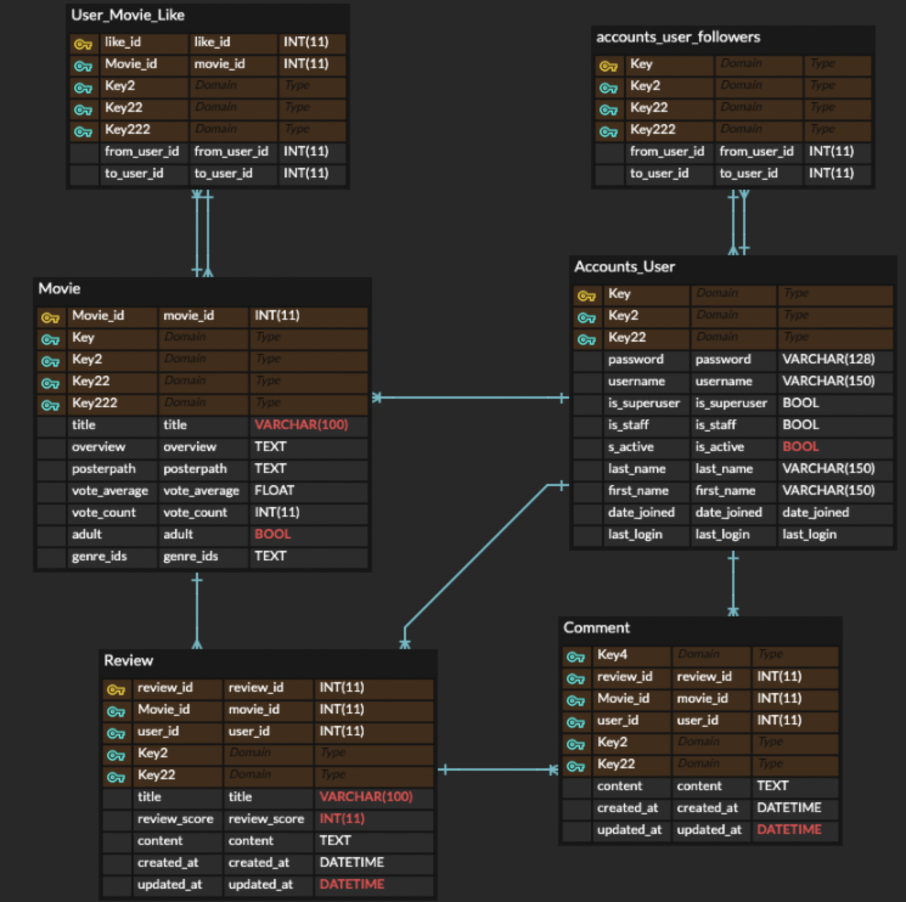
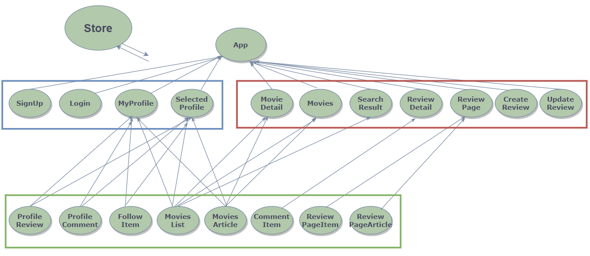

# 😎 Final PJT

## 1️⃣ 팀원 정보 및 업무 분담 내역

- ### 팀원 정보

  - 박준규(조장)
  - 오승철(조원)

- ### 업무 분담 내역

  - 공통 내역

    URL 설계, ERD

  - 박준규: 

    - 협업 툴 소개: Github Pull request → 협업 코딩 진행 , Slack → 프로젝트 일지, 이슈, Todo 기록

    - BackEnd

      - Model Init

      - Data Setting, Sampling 
      - Total ERD(Movie{main}, Accounts{part} Modeling)
        - Movie DRF
        - Review DRF
        - Part of accounts DRF
        - Recommendation System
        - Search Function
      - Using Machine Learning Method to Recommend Movie System

    - FrontEnd:

      - Main Page Styling
      - Part of Vue(From Recommendation System To Vue)
      - Search Function
      - main, profile CSS styling
      - part of Asynchronous Connection

    - Others: README, PPT

  - 오승철:

    - BackEnd:

      - Accounts: signup, login, logout, ID Overlapping, ChangePassWord, Follow

      - Like Function
      - Review
      - Comment
      - Connecting Between User and Vote_average, count
      - Total Accounts DRF
      - Part of Movie DRF

    - FrontEnd:

      - Totally Vue Router/Component Buildling(main)
      - Help Function, Layout, Infinity Scroll
      - Total CSS Layout
      - Star Score
      - Total of Asynchronous Connection

    - Others: 

      - Helping Service of Website
      - Deployment

## 2️⃣ 목표 서비스 구현 및 실제 구현 정도

- ### 목표 서비스: 누구나 쉽게 사용할 수 있어 편리한, 그리고 User가 입력한 정보를 토대로 원하는 Movie를 추천 받을 수 있는 웹사이트를 구현을 목표

- ### 실제 구현 정도 : 90 % ( 주관적 )

  ---

- #### 프로젝트 일지 | →은 결론을 의미

  ---

  #### 날짜: 5/14

  토의 내용
  준규: 백엔드 프론트엔드 구분없이 기능 위주 구현 제안
  승철: 백엔드 프론트엔드 나눠서 구현 제안
  결론: 백엔드 프론트엔드 구분없이 서로 도우며 기능 위주로 하기로 함.

  ---

  #### 날짜: 5/16

  토의 내용 : 기본 디자인
  준규: 왓챠 넷플릭스 참조 제안
  승철: 영화 추천 웹사이트인 키노라이츠도 참조 제안
  결론: 위에 언급한 곳을 둘러보면서 기본적, 필수적으로 구현할 기능들과 시간이 남으면 추가할 기능들로 구분 / 이후 기능 추가 고려

  ---

  #### 날짜: 5/18

  토의 내용
  준규: 완성에 중점을 두고 프로젝트를 진행하자 / 조 이름은 ICFY가 어떤지?
  결론: 조 이름은 ICFY로 결정 (I can find what you want)

  ## 사용자가 원하는 영화를 찾아주고 싶어서(I Can Find what You want: ICFY)

  ---

  #### 날짜: 5/19

  토의 내용 

  **핵심 기능 관련 **

  1. Vue+Drf or Only django → Vue+Drf
  2. App → navvar 사용
  3. 영화 목록, 영화 디테일, 유저 기능, 커뮤니티, 댓글
  4. 프로필 만들자
  5. vuex 사용 결정(유지보수 차원)

  **추가 기능 관련**

  1. 댓글+대댓글 / 리뷰+댓글 → 구현 성공
  2. 조회수 기능 (구현x)
  3. 인피니티 vs 캐로젤 → 인피티니 구현 성공
  4. 비슷한 영화 추천 → /movie/{movie_id}/similar (머신러닝으로 대체)
  5. 영화 제목 검색 → 추가기능 (구현 성공)

  

  **결론:** 최소 구현 기능만 먼저 고려
  우선 업무 : 모델, url, cors 해결 (백엔드 부분)

  ---

  #### 날짜: 5/20

  토의 내용

  **아침 회의**

  - **Model 관계 설정**

  1. TMDB API JSON → DB(가능한 DB에서 모든 데이터 해결)
  2. 필요한 모델 movie, genre, user, review, comment
  3. movie 모델 설정 (title overview, poster_path, vote_average, genre_id[ManyToMany], adult, popluarity)
  4. genre 모델 설정 (id, name)
  5. user 모델 설정 (AUTH_USER_MODEL)
  6. review(커뮤니티) 모델 설정 ( title, content, created_at, updated_at, foreinkey )
  7. comment ( review, user, content, created_at, updated_at )

  **210520**

  **django 기본 세팅 완료** **14:35**
   **movie/popular 2000개 데이터 django loaddata 완료** **14:52**
  **movies 파일부터 urls.py 작성 시작** **16:20**
  **MoviesList.vue까지 작성 완료  16:35**
  **승철 git error 발생** **17:05**
  **승철 git error 해결**  **18:00**
  **Detail Page 완성**

  **저녁 회의**

  - 준비사항
  - 내일 아침까지 역할 분담한 코드 프로토타입 완성
  - 승철: 프론트 부분 signup, login, logout
  - 준규: 백 부분 signup, login, logout

  **느낀점**
  **준규: 하루 했는데 생각보다 많이 해서 다행..**
  **승철: git의 중요성을 느낌.**

  결론: 모델 설정 → 데이터 클롤링 성공, url, 기본적인 툴 구현 성공
  이번 주까지 BACKEND 완성 목표

  ---

  #### 날짜: 5/21

  토의 내용 

  **아침 회의**

  - 목표: 커뮤니티 완성
  - 승철, 준규: 로그인 로그아웃 사인업 맞추기 (회원정보 수정 → profile이 완성 후 시작)
  - 위 해결되면, community로 시작
  - 승철: **09:14** 로그인 로그아웃 git pull 요망!
  - 준규: community back 부분 구현

  **점심 중간 점검**

  - 준규: community create back 부분 구현 완료 (**11:30**)

  **저녁 회의 18:08**

  - 준비사항
  - Back이랑 Front를 나눠서 하니까. 비효율적으로 느낌.
  - 기능 별로 나눠서 진행하는 것이 오히려 효율적이라 생각.
  - 한 사람이 처음부터 끝까지 해야 에러 찾기도 금방이고
  - 시간도 절약할 수 있음

  - 머신러닝을 할지 말지 이건 → 조금 더 고민해보고
  - 레이 아웃 관련도 조금 더 고민해봐야함.

  - 내일 **5/22** user 정보 수정/profile/password/회원정보/ 진행 예정

  ---

  #### 날짜: 5/22

  토의 내용:

  - 어떤 컨셉의 알고리즘을 사용할 예정인지?
    - 머신러닝 알고리즘을 사용해보고 안 되면, popular, similar로 해보자

  - 사용자에게 제공하고 싶은 core value 하나는 무엇인지?
    - 준규: 확률값 (로지스틱 회귀분석 → 확률값으로 출력 / 00님이 이 영화를 좋아할 확률은 00% 입니다)
    - 승철: 사용자 편의에 맞춘 UI 구현(자세한건 나중에 기록..)

  - 남은 계획
  - 위의 모든 것을 구현하는것...
  - **5/23(일)**은 휴식
    개인적으로 진행할 팀원만 진행
    준규: 프로필 페이지 기능 구현 예정
    승철: 장고 어드민 명세서의 A 기능 구현 예정

  ---

  #### 날짜: 5/25

  토의 내용

  **아침회의**

  준규: 추천 알고리즘 (영화 하나에 대한 추천) (예를 들면 특정 영화를 검색했을 때)
       관심 목록 기반, 리뷰 평점 기반, 장르로 찾고 popularity로 sorting을 함
       오늘 이걸 더 해볼 예정

  메인: 파퓰러로 할지 애초에 유저에게 관심있는 정보르 받아서 추천할지 생각해봐야 한다.

  디테일: 추천 가능 

  유저 모델에 장르를 어떻게 넣을지 고민해보겠다.

  승철: 슬랙에 적힌 걸 하나씩 구현하겠다.

  찜하기 기능의 아이콘은 빨간색 하트로

  **13:02**
  준규: 좋아요 기능 기반으로 한 알고리즘 테스트 시도 중
       영화 디테일 페이지에 추천 영화가 나오게 하겠다.
       메인 페이지에는 포스터만 보이도록 결정.

  승철: 영화 레이아웃을 두 가지로 보이게 하겠다.
       포스터 모드, 줄글 모드 (사용자 UI에 초점을 맞춤)
       마우스가 포스터 위로 올라가면 형광 초록색 테두리 만들기(반응형 웹 구축)
       글씨 위로 올라가면 파란색으로 바꾸기

  ---

  #### 날짜: 5/26

  토의 내용:11:15
  오전
  준규: 영화 유사성 판단 → 좋아요를 누르지 않은 영화를 클릭했을 때, 추천하는 방식 구현 성공
  승철: 비밀번호 변경, 회원탈퇴 구현 성공
  승철: 이슈 고치기, 인피티니 스크롤 구현 성공
  준규: CSS Bootstrap 레이아웃 잡기(리뷰, 댓글, 프로필) 

  ---

- ### 이슈 내역

  **이슈 기록 210519**

  이슈가 무엇인가요?: .accepted_renderer not set on Response
  이슈의 원인이 무엇인가요?: drf를 사용하는데 @api_view를 사용하지 않았음.
  해결을 어떻게 했나요?: @api_view를 붙여서 해결함. 주석처리를 해놨음. (편집됨) 

  

  **이슈 기록 210520**

  git merge → github 협업시 Fork를 안하고 clone 하는 경우 pr 반영 x.

  ---

  **이슈 기록 210521**
  **09:47**

  **이슈**

  - 회원가입은 되는데, 로그인이 되지 않음

  **이슈 원인**

  - signup 쪽에서 유저를 저장하지 않음

  ```python
  user.save()
  ```

  - 를 작성하지 않아서 생긴.. 그런.. ㅠㅠ

  **해결**

  - serializer의 경우 저장하는데, user는 저장되지 않는 코드에서 저장을 진행하게 되었음.

  ---

  **이슈 기록 210521**
  15:40
  **이슈**
  리뷰를 보여주는 게시판과 각각의 리뷰가 안 나오고 각종 400대 에러의 등장

  **이슈 원인**

  - 프론트단에서는 요청을 보내는 url을 잘못 보내고 있었고 serializers에서 read_only_fields를 제대로 작성하지 않았고 views.py에서 오타도 있는 등 많은 실수로 인해 발생

  **해결**

  - 로직의 처음 시작부터 하나하나 꼼꼼하게 봤더니 해결할 수 있었습니다. 중간 중간 확인하는 과정이 중요하다는 걸 느꼈습니다

  ---

  **이슈 기록 210522**

  16:11

  **이슈**

  - 회원정보를 받는 도중 response를 못받음

  ```python
  @api_view(['GET'])
  def profile(request, username):
      person = get_object_or_404(get_user_model(), username=username)
      serializer = UserSerializer(data=person)
      if serializer.is_valid():
          return Response(serializer.data, status=status.HTTP_200_OK)
  ```

  - 이슈의 원인은 무엇인가요?

  ```python
  @api_view(['GET'])
  def profile(request, username):
      person = get_object_or_404(get_user_model(), username=username)
      serializer = UserSerializer(person)
      return Response(serializer.data, status=status.HTTP_200_OK)
  ```

  위와 같이 GET 방식으로 받고있기 때문에 is_valid()가 필요없었음
  하지만 아직 response를 vue에서 받고 있지 않음 이부분 고려 다시 해야함.

  - 해결을 어떻게 했나요?

  ```Template
  @click → @click.native
  ```

  로 바꾸니 해결됨
  app에 들어가는 router link는 a 태그와 비슷한데 a 태그와는 다름 따라서 methods를 작동시키게 하려면, native를 넣어주어야 한다.**17:30**이슈가 무엇인가요?: 프로필 페이지에서 새로고침을 하면 state의 username을 가져오지 못함. 이게 다른 페이지가 아닌 profile에서만 작동함....아직 해결 mm 답변 기다리는 중..

  ---

  **이슈 기록 210523**
  19:47

  **이슈**

  user id를 기반으로 작성한 리뷰와 댓글을 불러오려고 했으나 404 에러가 나옴

  **이슈 원인**

  get_list_or_404를 쓰면 작성한 리뷰 또는 댓글이 없을 경우 404 에러가 나옴

  **해결**

  ORM의 filter로 정보를 불러와야함. 이 때 many=True를 적어주어야 하고 두 개의 array를 보낼 때는 return Response([review_serializer.data, comment_serializer.data])처럼 더해서 보내주어야함.

  ---

  **이슈 기록 210524**

  15:33

  **이슈**
  user의 id를 통해서 user의 username을 찾으려고 요청을 보냈으나 404 에러가 나왔다.

  **이슈 원인**
  urls.py에서

  ```python
   path('check/<str:username>/', views.check, name='check'),
   path('check/<int:user_id>/', views.find_username, name='find_username'),
  ```

  앞의 경로가 같으니까 아래의 url로 요청이 안 가고 위의 url로 요청이 가고 있었다.

  **해결**
  아래 url의 check를 find로 바꾸었다.

  ---

  **이슈 기록 210525**

  16:39
  이슈에 대해서 종합적으로 서술하겠음검색 기능을 구현하던 중에 NavigationDuplicated error
  왜 지금 주소로 또 가겠냐는 에러임.
  이 에러를 해결하기 위해서 query에 현재시간을 주었고 이로 인해 매번 다른 주소로 가게 됨.
  네이버에서도 타짜를 검색했을 때와, 재심을 검색하고 타짜를 검색했을 때 url이 다르다. 후자가 덕지덕지 붙음.
  `this.$router.push({ name: 'SearchResult', params: { searchKeyword: this.searchKeyword }, query: { t: new Date().getTime()} })`
  이렇게 하고 updated를 적어주면 검색은 되는데 무한 루프에 빠짐.
  그래서 watch랑 computed를 이용하여 해결됨,
  computed로 url을 변경시키고 watch가 이를 포착하여 요청을 보내도록 만들었음.

  

  --이슈 기록--**210526**

  1. MovieDetail.vue에서 나오는 추천 영화를 클릭하면 해당 영화의 디테일 페이지로 넘어가지 않음 <Debugging 완료>
  2. MovieDetail.vue에서는 UI를 다르게 볼 수 없음 <Debugging 완료>
  3. MovieDetail.vue에서 좋아요를 누르면 참여수가 변경되는 경우가 있음(리뷰를 달아야지 변경되어야 함.) <Debugging 완료>
  4. UI 페이지가 바뀌면 좋아요 표식이 사라짐, 하지만, 좋아요는 기록되어 있음 <Debugging 완료>
  5. 리뷰페이지를 수정했을 때 점수 창이 별로 변환되지 않음 <Debugging 완료>

  ---

## 3️⃣ 데이터 베이스 모델링(ERD)



---

## 4️⃣ 필수 기능에 대한 설명

1. 영화정보

   TMDB AP를 이용 1000여개의 영화 데이터 확보, API는 popular 영화만 이용

2. 사용자의 영화 추천 서비스

   Cosine Simliarity(코사인 유사도: 두 벡터의 내적을 이용한 거리)를 이용한 영화 추천 서비스 구축 성공

3. 웹 디자인

   CSS, Bootstrap을 활용한 웹 디자인 보완

4. 관리자 권한 유저의 영화 등록, 수정, 삭제 권한

   웹 사이트에 관리자 아이디로 접속시 페이지 상단 admin 페이지로 넘어갈 수 있도록 명세 A 구현 성공

5. 일반 유저 권한

   모든 로그인 된 유저는 영화에 대한 평점 등록, 수정, 삭제 구현 성공

6. 5번 결과로 인해 사용자에게 영화 추천

   상기 2번 구현을 통해 6번 구현 성공

7. 추천 알고리즘 1개 이상 구현

   2번 구현을 통해 2개의 추천 알고리즘 구현 성공 Recommend Movie / Similarity Movie

8. 추천 시스템에 대한 개념

   Cosine Simliarity(코사인 유사도: 두 벡터의 내적을 이용한 거리) 이용

9. 영화 커뮤니티

   각각의 영화별 리뷰와 댓글을 입력할 수 있는 커뮤니티 구현 성공

10. 작성자만 본인의 글 수정, 삭제

    구현 성공

11. 게시글과 댓글의 생성 미 수정 시각 정보

    Modeling 구축시 해당 변수 생성 완료

12. 최소한 5개 이상의 url 및 페이지를 구성

    App.vue를 제외한 8개의 components, 11개의 views 파일로 구성 / accounts/urls.py → 9개의 url | movies/urls.py → 15개의 url 로 구성

13. Ajax를 활용한 비동기 요청

    좋아요, 팔로우, 리뷰 수정, 삭제, 댓글, 수정, 삭제 등 비동기 구현 성공 사용자 경험 향상 양호

참고사항 컴포넌트 트리

---

## 5️⃣ 배포 서버 URL

netlify : https://eager-swanson-093a03.netlify.app/

AWS : icfymovie.net/

(✔️참고: 맥 OS의 경우 이슈가 여럿 발견 됨...ㅠ )

### 버그 픽스

윈도우 2대, 맥 2대로 배포한 웹사이트에 들어가본 결과 윈도우의 경우 검색 기능이 잘 동작하지만 맥에서는 검색 결과가 나왔다가 바로 메인 페이지로 이동하는 버그를 배포 후에 찾음

### 보완 사항

DB에 담긴 영화의 수가 많아지면서 메인 페이지의 로딩 속도가 느려지는데 코드를 다르게 짜서 로딩 속도를 줄이거나 인피니트 스크롤 혹은 페이지네이션을 통해서 개선하는 작업이 필요함 

가능하다면 사용자의 연령을 비롯한 여러 특징들을 수집하고 이를 영화 추천 알고리즘에 반영한다면 더 좋은 영화 추천을 할 수 있을 것 같음.

---

## 6️⃣ 느낀점

### 준규

- 지금껏 코딩 때문에 밤은 샌적은 없었다. 그리고 이번에 살면서 처음으로 웹 서비스를 구축하기 위해 밤을 샜다. 이 프로젝트가 나에게 어떤 의의가 있는지 곰곰히 생각해보면, 처음으로 무언가를 만들고 배포하고 안 되는 기능을 구현하기 위해 머리를 맞대고 곰곰히 생각하는 우리의 모습은 신입 개발자의 모습을 하고 있는 것이 아닌지 생각든다.

  5개월은 얼마 살지 않은 나에게도 짧은 시간으로 생각한다. 하지만 올해 싸피에서 보낸 5개월은 그 농도가 내가 지금껏 살아왔던 시간 중 어느 기간과 비교해도 짙었다. 그리고 개발의 꿈을 갖고 입학한 싸피에서 내 첫 작품을 배포하는 일이 생겨 정말 뜻깊고 기쁘다.

  하지만 기쁨은 잠시 접어두자. 아직 할게 많고 배우고 싶은게 쌓더미이다. 이번 프로젝트를 하면서 확실히 느낀건 나의 적성이 개발과 알맞다는 것과 지금처럼 쭉 달리면 된다는 것이다.

  이번 프로젝트에서 나는 프로젝트의 핵심 포인트가 되는 추천 알고리즘을 주로 맡아서 했다. 그래서 고민도 많이하고 생각보다 vue에 신경을 많이 못쓴것은 사실이다. 따라서 승철이게 미안한 마음이 크다. 하지만, 협업이라는게 이런걸까 생각든다. 내가 맡은 일은 성공적으로 마무리했지만, 같이 구현하지 못한 부분에 대해 미안함을 느낀다. 그리고 다음 프로젝트에서는 이러한 부분을 보안해서 점점 좋은 개발자가 되어야겠다는 다짐을 하게 되었다.

  `이번 프로젝트는 나에게 '개발자의 가능성을 보여준' 최근에 발생한 가장 뜻 깊은 사건이다.`

---

### 승철

- 프로젝트 기간동안 열심히 집중해서 진행했고 힘들기도 했지만 그 과정에서 재미를 느꼈다. 하나씩 완성해가는 것에서 느끼는 성취감이 좋았다. 동시에 내가 부족한 부분을 많이 느꼈고 추후에 프로젝트 코드를 보면서 리팩토링을 하면서 부족한 점을 조금씩 고쳐나가고 싶다. 특히 CSS와 Vue.js 코드를 작성하면서 아쉬움을 느꼈고 제대로 고쳐보고 싶다. 준규와 의견이 맞지 않는 점도 있었고 의견을 교환하는 과정이 번거로울 때도 있었지만 서로 장점들을 모아져서 혼자했을 때보다 더 좋은 결과물이 나온 것 같다.

  프로젝트를 할 때는 설계를 하는 것이 무척 중요하다고 다시 느꼈다. 준규 덕분에 올바른 DB의 사용법을 알았고 명세서에 적힌 내용을 구현할 수 있었다. URL 설계도 미리 하고 어떤 함수를 사용할지 이때 어떤 params를 사용할지 미리 생각하면 좋겠다고 느꼈다. 여러 에러를 만나면서 에러를 해결하는 능력도 길렀다. 디버깅하는 실력이 많이 늘었다.

  마지막 날에 배포를 진행했는데 시간에 쫓기는 불안감을 느끼면서도 무언가 미지의 세계를 탐험하는 재미를 느꼈다. 내일부터는 시간이 남으니 오늘 급하게 넘어갔던 내용도 다시 살펴보고 싶다. 배포까지 해서 누구나 내 웹사이트에 들어올 수 있다고 생각하니 기분이 좋다.